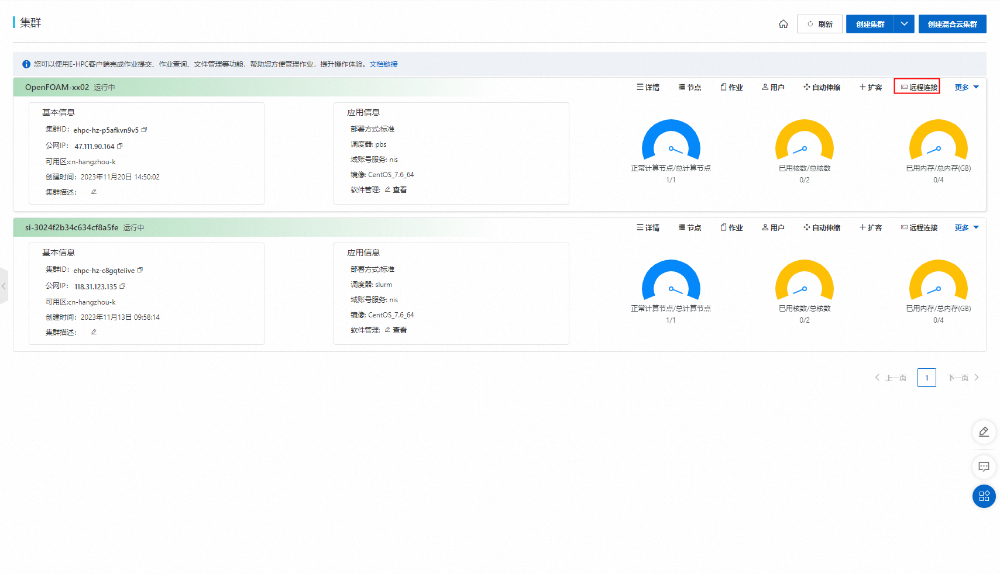

# OpenFOAM Ehpc计算巢快速部署

>**免责声明：**本服务由第三方提供，我们尽力确保其安全性、准确性和可靠性，但无法保证其完全免于故障、中断、错误或攻击。因此，本公司在此声明：对于本服务的内容、准确性、完整性、可靠性、适用性以及及时性不作任何陈述、保证或承诺，不对您使用本服务所产生的任何直接或间接的损失或损害承担任何责任；对于您通过本服务访问的第三方网站、应用程序、产品和服务，不对其内容、准确性、完整性、可靠性、适用性以及及时性承担任何责任，您应自行承担使用后果产生的风险和责任；对于因您使用本服务而产生的任何损失、损害，包括但不限于直接损失、间接损失、利润损失、商誉损失、数据损失或其他经济损失，不承担任何责任，即使本公司事先已被告知可能存在此类损失或损害的可能性；我们保留不时修改本声明的权利，因此请您在使用本服务前定期检查本声明。如果您对本声明或本服务存在任何问题或疑问，请联系我们。

## 概述

OpenFOAM（Open Source Field Operation and Manipulation）是对连续介质力学问题进行数值计算的软件。可进行数据预处理、后处理和自定义求解器，常用于计算流体力学领域。更多信息，请参见OpenFOAM官网。

## 前提条件

部署OpenFOAM社区版服务实例，需要对部分阿里云资源进行访问和创建操作。因此您的账号需要包含如下资源的权限。
  **说明**：当您的账号是RAM账号时，才需要添加此权限。

| 权限策略名称                          | 备注                     |
|---------------------------------|------------------------|
| AliyunECSFullAccess             | 管理云服务器服务（ECS）的权限       |
| AliyunVPCFullAccess             | 管理专有网络（VPC）的权限         |
| AliyunROSFullAccess             | 管理资源编排服务（ROS）的权限       |
| AliyunEHPCFullAccess             | 管理弹性高性能计算（EHPC）的权限       |
| AliyunNASFullAccess             | 管理文件存储（NAS）的权限       |
| AliyunComputeNestUserFullAccess | 管理计算巢服务（ComputeNest）的用户侧权限 |


## 计费说明

OpenFOAM社区版在计算巢部署的费用主要涉及：

- 弹性高性能计算集群（EHPC）费用
- 文件系统（NAS）费用
- 流量带宽费用

## 部署架构


- 部署由一个ehpc集群组成，ehpc集群中包括manager节点、schedule节点和compute节点
- 服务使用nas-cpfs构建高性能共享文件系统

## 参数说明
| 参数组       | 参数项      | 说明                                                                     |
|-----------|----------|------------------------------------------------------------------------|
| 服务实例      | 服务实例名称   | 长度不超过64个字符，必须以英文字母开头，可包含数字、英文字母、短划线（-）和下划线（_）                          |
|           | 地域       | 服务实例部署的地域                                                              |
|           | 付费类型     | 资源的计费类型：按量付费和包年包月                                                      |
| EHPC集群配置  | 集群登录密码   | 长度8-30，必须包含三项（大写字母、小写字母、数字、 ()`~!@#$%^&*-+=&#124;{}[]:;'<>,.?/ 中的特殊符号） | 
|           | Ehpc部署模式 | Tiny，Simple，Standard                                                   |
|           | 计算节点实例类型 | 可用区下可以使用的计算节点规格                                                        |
|           | 计算节点数量   | 计算节点数量, 可选值: 1-99                                                      |
|           | 登录节点实例类型 | 可用区下可以使用的登录节点规格                                                        |
|           | 管控节点数量   | 管控节点数量, 可选值: 1,2,4                                                     |
| EHPC集群用户配置 | 用户密码     | 长度8-30，必须包含三项（大写字母、小写字母、数字、()~!@#$%^&*-_+=\{}[]:;'/<>,.?/中的特殊符号）    |
|                | 用户名称     | 登录集群所用的用户名，默认为foamtest                                                   |
| 网络配置      | 可用区      | ECS实例所在可用区                                                             |
|           | VPC ID   | 资源所在VPC                                                                |
|           | 交换机ID    | 资源所在交换机                                                                |

## 部署流程
1. 访问计算巢OpenFOAM社区版[部署链接](https://computenest.console.aliyun.com/service/instance/create/cn-hangzhou?type=user&ServiceId=service-9b427cbf0dcf4d5b988d)，按提示填写部署参数：
    

2. 参数填写完成后可以看到对应询价明细，确认参数后点击**下一步：确认订单**。
   

3. 确认订单完成后同意服务协议并点击**立即创建**
   进入部署阶段。
    

## 使用流程
### 步骤一：通过控制台连接集群
1. 登录[弹性高性能计算控制台](https://ehpc.console.aliyun.com)。
2. 在顶部菜单栏左上角处，选择地域。
3. 在左侧导航栏，单击**集群**。
4. 在**集群**页面，找到在计算巢部署好的目标集群，单击**远程连接**。
    
5. 在**远程连接**页面，输入集群用户名、登录密码和端口，单击**ssh连接**。

### **步骤二：运行算例**

   本文利用OpenFOAM中的simpleFoam求解器计算摩托车外流场，算例路径为$FOAM_TUTORIALS/incompressible/simpleFoam/motorBike/。

1.设置环境变量。

```
export MODULEPATH=/opt/ehpcmodulefiles/
module load openfoam-openmpi/5.0
module load openmpi/1.10.7
```

2.准备算例文件。

```
mkdir /home/foamtest/motorBike
cp -r /opt/OpenFOAM/OpenFOAM-5.0/tutorials/incompressible/simpleFoam/motorBike/* /home/foamtest/motorBike
```

3.运行算例。

```
cd /home/foamtest/motorBike
source /opt/OpenFOAM/OpenFOAM-5.0/etc/bashrc
./Allrun
```

### **步骤三：查看结果**

执行以下命令，查看结果文件。

```
cat /home/foamtest/motorBike/log.blockMesh
```

预期返回如下：
     